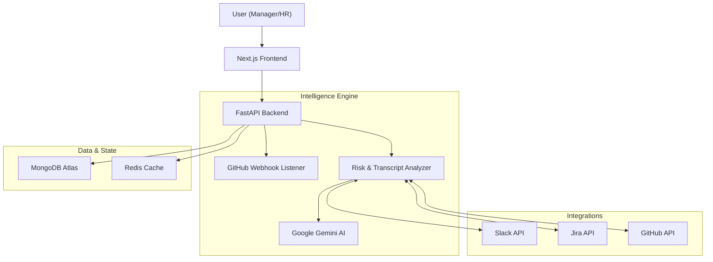

# Loop AI: Engineering Intelligence Layer

<div align="center">


[](LICENSE)
[](https://www.python.org/)
[](https://nextjs.org/)
[](https://render.com/)

**Unlock the hidden velocity of your engineering team.**
Loop AI connects code, communication, and culture to provide actionable insights for Managers and HR.

[Features](#-features) • [Architecture](#-architecture) • [Installation](#-installation) • [Usage](#-usage) • [Documentation](#-documentation)

</div>

---

## 📋 Table of Contents

- [Overview](#-overview)
- [Key Features](#-key-features)
- [Architecture](#-architecture)
- [Tech Stack](#️-tech-stack)
- [Installation](#-installation)
- [Configuration](#-configuration)
- [Deployment](#-deployment)
- [License](#-license)

---

## 🌟 Overview

**Loop AI** (powered by the **NovaScan** engine) is a comprehensive engineering intelligence platform. It goes beyond simple code metrics by correlating **GitHub activity** with **Slack communication** and **Daily Standups**.

By analyzing the "soft signals" of engineering work—blockers discussed in standups, sentiment in Slack, and intent behind code changes—Loop AI helps organizations:
*   **Predict Burnout**: Tracking risk scores and overtime commit patterns.
*   **Automate Management**: Turning standup transcripts into Jira tickets and calendar events.
*   **Verify Intent**: Distinguishing between emergency hotfixes and careless mistakes.

---

## 🚀 Key Features

### 🧠 Intelligent Risk & Intent Analysis (NovaScan)
- **Contextual Risk Scoring**: Uses **Google Gemini** to analyze PR diffs + Slack context.
- **False Positive Reduction**: Understands if a "dangerous" change was a planned hotfix discussed in Slack.
- **Automated Triage**: High-risk changes trigger Jira tickets and Slack alerts automatically.

### 🗣️ Automated Standup Assistant
- **Transcript Analysis**: Paste raw standup transcripts (text or audio logs).
- **Action Extraction**: Automatically identifies:
    - **Tasks** -> Proposed Jira Tickets
    - **Blockers** -> High-priority Alerts
    - **Events** -> Calendar Invites
- **One-Click Execution**: Create tickets and invites directly from the dashboard.

### 👥 Role-Based Dashboards
- **Manager View**:
    - Project Health & Risk Overview.
    - Active PRs & Critical Issues.
    - Team Velocity & Burnout indicators.
- **HR / Organization View**:
    - Company-wide Pulse.
    - Retention Risk Analysis.
    - Cultural alignment scores.

### 🎨 Modern & Responsive UI
- **Dark Mode Support**: Fully themed UI with light/dark persistence.
- **Interactive Data**: Real-time charts and activity feeds.
- **Mobile Responsive**: Manage your team on the go.

---

## 🏗️ Architecture



---

## 🛠️ Tech Stack

| Component | Technology | Purpose |
|-----------|-----------|---------|
| **Frontend** | **Next.js 14** (App Router) | React Framework with SSR/RSC |
| | **TailwindCSS** + **Shadcn/UI** | Styling & UI Components |
| | **Framer Motion** | Animations |
| | **Next-Themes** | Dark Mode Persistence |
| **Backend** | **FastAPI** (Python 3.10) | High-performance Async API |
| | **Motor** (MongoDB) | Async Database Driver |
| | **Pydantic** | Data Validation & Settings |
| **AI & ML** | **Google Gemini 1.5** | LLM for Code & Text Analysis |
| **Infra** | **MongoDB Atlas** | Database |
| | **Redis** | Caching & Rate Limiting |
| | **Render** | Production Deployment |

---

## 📥 Installation

### Prerequisites
- Python 3.10+
- Node.js 18+
- MongoDB Atlas URI
- Google Gemini API Key

### 1. Clone & Setup Backend

```bash
git clone https://github.com/Ayushkaranth/LoopAI.git
cd LoopAI/backend

# Create virtual env
python -m venv venv
source venv/bin/activate  # Windows: venv\Scripts\activate

# Install dependencies
pip install -r requirements.txt

# Run server
uvicorn main:app --reload
```

### 2. Setup Frontend

```bash
cd ../frontend

# Install dependencies
npm install

# Run development server
npm run dev
```

---

## ⚙️ Configuration

### Backend (`backend/.env`)

```env
PROJECT_NAME="Loop AI"
BASE_URL="https://novascan-backend.onrender.com" # or http://localhost:8000 for dev

# Database
MONGODB_URL="mongodb+srv://..."
REDIS_URL="redis://..."

# AI
GEMINI_API_KEY="AIzaSy..."

# Integrations
SLACK_BOT_TOKEN="xoxb-..."
GITHUB_ACCESS_TOKEN="ghp_..."
JIRA_URL="https://your-domain.atlassian.net"
JIRA_API_TOKEN="..."
```

### Frontend (`frontend/.env.local` or environment variables)

```env
# Point to your backend (Local or Production)
NEXT_PUBLIC_API_URL="https://novascan-backend.onrender.com/api/v1"
```

---

## 🚀 Deployment

The system is designed to be deployed on **Render** (or similar PaaS).

1.  **Backend**: Deploy as a Web Service (Python). Set build command `pip install -r requirements.txt` and start command `uvicorn main:app --host 0.0.0.0 --port 10000`.
2.  **Frontend**: Deploy as a Static Site or Node Service on Vercel/Netlify/Render. Ensure `NEXT_PUBLIC_API_URL` is set in the build environment.

---

## 📄 License

This project is licensed under the MIT License.
